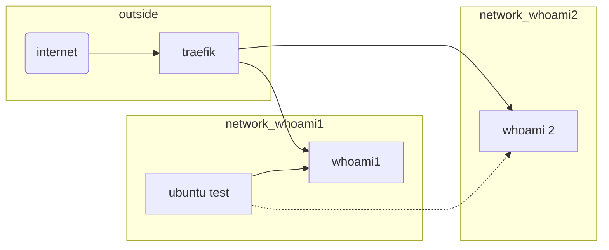

# Segregation for better security

This example shows how to segregate the services behind traefik, for a better security.
In Docker is possible to generate multiple networks that as default configuration cannot talk each other and are not reachable from outside Docker.


## Getting Started

### Prerequisites

1. A domain name that point to Traefik, we assume for these examples the domain `example.com`.
2. The basic example is working.

### Structure
I'm this example we are using two simple whoami container and a Ubuntu instance to test inside Docker.




With the Ubuntu container we can check the reachebeality of the two whoami containers.


## Installing

1. Generate all the container with this command (maybe you need sudo).

    ```bash
    docker-compose up -d
    ```

2. Generate the Ubuntu container (mybe you need sudo)

	```bash
		docker run --name ubuntutest -d -it ubuntu
	```

3. Connect Ubuntu to the whoami1 network, first you need to identify the networkname assigned from `docker-compose`. In the results from the firs command you should find a text like `xyz_net_whoami1`. `xyz` can be you username or another text. Copy the text in the second command.

	```bash
  	sudo docker network ls
	sudo docker network connect xyz_net_whoami1 ubuntutest
	```

4. Connect to the console of Ubuntu container

	```bash
		sudo docker start ubuntutest
		sudo docker attach ubuntutest
	```

5. In Ubuntu you need to install some tools

	```bash
		apt update
		apt install -y iproute2
		apt install -y iputils-ping
	```

6. Launch the ping to the two whoami containers `whoami1` and `whoami2`

	```bash
		ping whoami1
		ping whoami2
	```

7. The ping results show that `whoami1` is reacheable and `whoami2` is not reacheable

### Security

Segmentation of the docker network allow you to reduce the attack surface in case a malicius container is running in you docker environement. You can chose to assign a network to every service, or to create networks depending of service class.


If you find a problem in this guide or in the configurations files you can open an [issue](https://github.com/frigi83/traefik-examples/issues) on GitHub. Thanks!
